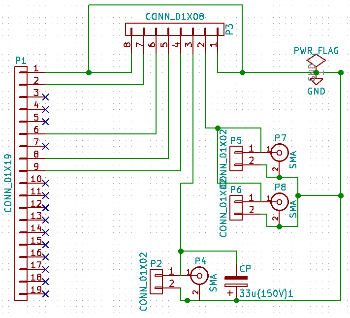

# Daughter board

## Name
[`DB-pulser_v2`]()

## Title
Daughter board pulser version 2

## Author
* [`CTC-dubois_jerome`]()

## Modules included
* [`MDL-pulser_v2`]()

## Interfaces
### Input
* [`ITF-A_gnd`]()
* [`ITF-B_5v`]()
* [`ITF-F_12v`]()
* [`ITF-H_neg_12v`]()
* [`ITF-I_pulse_on`]()

### Output
* [`ITF-A_gnd`]()

##External connections
### Input
* -100V (P2, P4)
* -100V pulse (P3)

### Output
* 5V, +/-12V, -100V, logic pulse
* -100V pulse (P5, P6, P7, P8)

## Scheme

## Remarks
[BOM](./src/DB-pulser_v2.csv)

This daughter use an extenernal MAX4940 evaluation kit. This board is connected to the daughter board *via* the connector P3. The -100V input is connect *via* connector P2 or P4 (angled socket and SMA connector respectively). Output connector P5, P6, P7, P8 are used to plugged the transducer and to connect to DB_tr_switch_tgc. Scheme on how to connect the MAX4940 to connector P3 is given on [MDL-pulser_v2](../../../modules/hardware/MDL-pulser/MDL-pulser_v2)

## Results

## Pros/Cons/Constraint:

**Pros:** NA

**Cons:** NA

**Constraint:** NA
