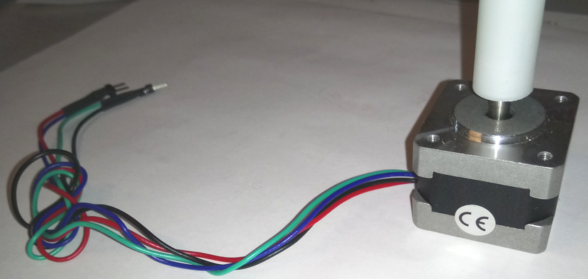

# Module

## Name
[`MDL-motor_V2`]()

## Title
Motor version 2, stepper motor

## Author
* [`CTC-dubois_jerome`]()
* [`CTC-wang_feng`]()
* [`CTC-vincent_benoit`]()

## About
In order to construct a 2D image, we have to move the transducer with a sweeping movement. This can be done with a stepper motor.

## Uses
### Input
* [`ITF-N_stepper_b2`]()
* [`ITF-O_stepper_b1`]()
* [`ITF-P_stepper_a1`]()
* [`ITF-Q_stepper_a2`]()

### Output
* NA

## Functions
* [`FCT-sensing_sweeping`]()

## Scheme

## Remarks
The motor we use can be found here (or see [doc](./doc/stepper.pdf)): [http://www.gotronic.fr/art-moteur-14hm11-0404s-23048.htm](http://www.gotronic.fr/art-moteur-14hm11-0404s-23048.htm). It's a 12V stepper motor with 400 steps by tour.

## Results

## Pros/Cons/Constraint:

**Pros:** simple, total control of the movement

**Cons:** NA

**Constraint:** need mechanical stop to initialise the position of the motor
