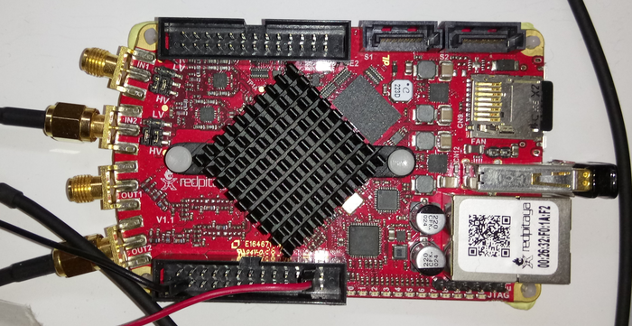
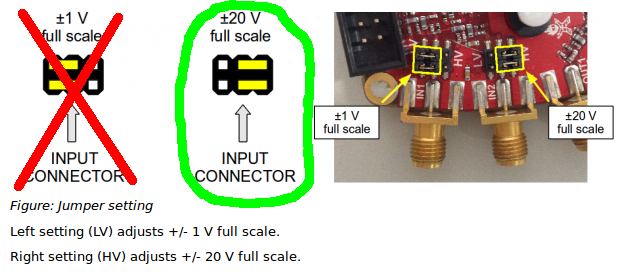

# Module

## Name
[`MDL-redpitaya`]()

## Title
RedPitaya board

## Author
* [`CTC-dubois_jerome`]()

## About
RedPitaya is a commercial board that is not a daugter board for our system but bring together different modules we have not develop yet (MDL_Ramp, MDL_ADC, MDL_WIFI).

For informations about this board one can look at their [website](http://www.redpitaya.com).

## Uses
### Input
* [`ITF-A_gnd`]()
* [`ITF-E_signal_envelope`]()
* [`ITF-K_pulse_redpitaya`]()

### Output
* [`ITF-A_gnd`]()
* [`ITF-G_gain_control`]()

## Functions
* [`FCT-signal_processing_calculating_pixel`]()

## Scheme

## Remarks

###General
RedPitaya board need a 5V, 2A supply for the RedPitya.

Before turning on the RedPitaya, please copy the [old OS server files](./OS/server/) (./OS/server/) into a blank micro-SD card. We use the old RedPitaya OS (0.92) because we have found a bug with the trigger C function with the new OS.

You must also plug a WIFI dongle (such as [edimax EW_7811Un dongle](http://www.edimax.fr/edimax/merchandise/merchandise_detail/data/edimax/fr/wireless_adapters_n150/ew-7811un/)). With the files you have copy into the SD card, the RedPitaya act as an access point, the WIFI name is redpitaya and the pass is also redpitaya. It's IP adress is 192.168.128.3 and pass and ID are both root. So to access the RedPitaya *via* ssh one must enter the folowing command lines:  
`ssh root@192.168.128.3`  
`root`

ITF-D_signal_envelope can be plug either on IN1 or IN2 (for the moment, IN2 programed in the soft), but **you must put the jumper on high voltage mode** (full scale +/- 20V):  

[`ITF-G_gain_control`] can be plug either on OUT1 or OUT2 (for the moment, IN2 programed in the soft).

[`ITF-K_pulse_redpitaya`] is connect to PIN 3 of E1 connector.

## Results

## Pros/Cons/Constraint:

**Pros:** NA

**Cons:** expansive

**Constraint:** need 5V, 2A supply
