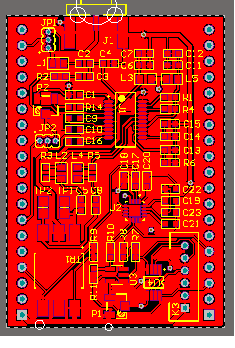

# Module: Goblin

## Name
[`MDL-goblin_tgcenvadc`]()

## Title
Goblin TGC-Envelop-ADC

## About
* The analog signal-processing heart of the echOmods
* version: V0.1
* date: 24/04/2016
* technology: Module-compatible, Homemade PCB, ICs based on `AD8331` and `ADL5511`
* language: Altium
* author: Kelu124

## IOs

### Inputs

* [`ITF-A_gnd`](../../interfaces/ITF-A_gnd)
* [`ITF-B_5v`](../../interfaces/ITF-B_5v)
* [`ITF-S_3_3v`](../../interfaces/ITF-S_3_3v)
* [`ITF-G_gain_control`](../../interfaces/ITF-G_gain_control)
* [`ITF-C_amplified_raw_signal`](../../interfaces/ITF-C_amplified_raw_signal) : because it's used internally
* [`ITF-E_signal_envelope`](../../interfaces/ITF-E_signal_envelope) : because it's used internally
* [`ITF-R_reserved`](../../interfaces/ITF-R_reserved) : for the signal coming from the pulser (if through track R)
* [`ITF-mET_SMA`](../../interfaces/ITF-mET_SMA) : for the signal coming from the pulser (if through SMA)

### Outputs

* [`ITF-C_amplified_raw_signal`](../../interfaces/ITF-C_amplified_raw_signal): Amplified Raw Signal, post TGC, before `ADL5511`
* [`ITF-E_signal_envelope`](../../interfaces/ITF-E_signal_envelope): enveloppe of the signal, post TGC
* [`ITF-mEG_SPI`](../../interfaces/ITF-mEG_SPI) : signal from the ADC

## Key Components

* `ADL5511`: Enveloppe detection 
* `AD8331`: TGC
* `AD7274`: 2Msps SPI ADC

## Information

### What is it supposed to do?

The aim of this echOmod is to get the signal coming back from a transducer, and to deliver the signal, analogically processed.

In order to test different solutions, this specific version of Goblin uses jumpers to select different inputs/outputs. 

First try at a SPI ADC. Using a 2 Msps one in order to catch only the enveloppe, to be tested with other uC, RPi or BBB. No more.

### How does it work: block diagram

* [`ITF-G_gain_control`](../../interfaces/ITF-G_gain_control)->`AD8331`->[`ITF-C_amplified_raw_signal`](../../interfaces/ITF-C_amplified_raw_signal)->`ADL5511`->[`ITF-E_signal_envelope`](../../interfaces/ITF-E_signal_envelope)->`AD7274`->[`ITF-mEG_SPI`](../../interfaces/ITF-mEG_SPI)
* [`ITF-R_reserved`](../../interfaces/ITF-R_reserved)->`AD8331`
* [`ITF-mET_SMA`](../../interfaces/ITF-mET_SMA)->`AD8331`

## About the module

### Pros

* Only needs 5V and 3.3V
* Energy use : TODO
* ADC V_REF is flexible: better resolution in output of the ADC
* E_REF is being removed from the signal output, better than Murgen, where we lost 1.1V from the signal

### Cons

* Takes a lot of space because of the modularity. Jumpers and pots could be removed.
* Little flexibility from the use of ICs.

### Constraint and limits

## Discussions

## License

### echOmods 

The [echOmods project](https://github.com/kelu124/echomods) and its prototypes (so Goblin) are open hardware, and working with open-hardware components.

Licensed under TAPR Open Hardware License (www.tapr.org/OHL)

Copyright Kelu124 (luc@echopen.org / kelu124@gmail.com ) 2015-2018

### Based on 

The following work is base on a previous TAPR project, [Murgen](https://github.com/kelu124/murgen-dev-kit) - and respects its TAPR license.

Copyright Murgen and Kelu124 (murgen@echopen.org , luc@echopen.org / kelu124@gmail.com ) 2015-2018
