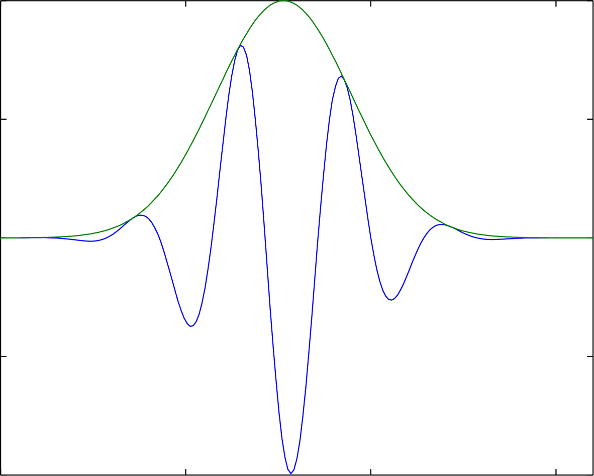
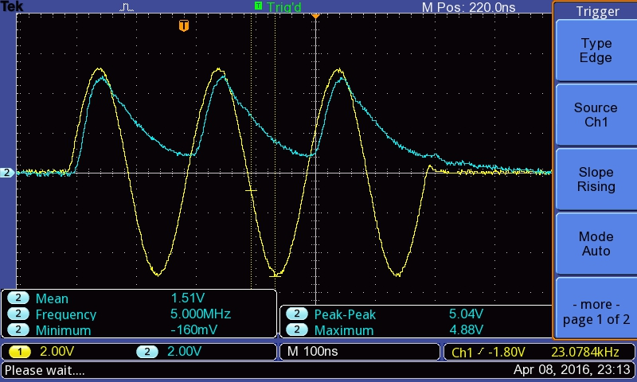

# Module

## Name
[`MDL-envelope_detector_v1`]()

## Title
Envelope detector version 1

## Author
* [`CTC-koyratee-farad`]()

## Description
The acoustic image is given by the value of acoustic intensity on each point. The acoustic intensity is $I \propto 10 \log \left( \left| p \right|^2\right)$ where p is the acoustic pressure (measured by the transducer). $\left| p \right|$ is the amplitude of the pressure, this amplitude is given by the envelope of the acoustic echoes.
Input: electric echoes (alternative signal, green curve).
Output : envelope of the echoes (red curve).

## Uses
### Input
* [`ITF-A_gnd`]()
* [`ITF-D_amplified_filtered_signal`]()

### Output
* [`ITF-A_gnd`]()
* [`ITF-E_signal_envelope`]()

## Functions
* [`FCT-signal_processing_envelop_detecting`]()

## Scheme

## Remarks
Value of R1 and C1 are defined for RedPiataya measurement.
Value of R1 (and/or C1) must be refined for use of a different probe.

## Results
Input (yellow curve)/Output (bleu curve)

## Pros/Cons/Constraint:

**Pros :** simple

**Cons :** the envelope is detected only for the positive value of the signal, so the envelpe decrease between each positive lobs of the echoes.

**Constraint :** NA
