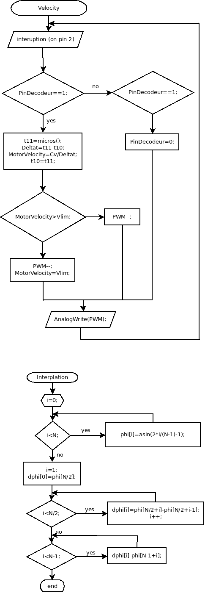

Module: MDL_Motor_Control_Hard

Function: sensing

Sub-Function: emitting

We use a single transducer, it must sweep an given angle in order to make 2D imaging, this can be done with a movement convertor. But if we want to uniformely scan the angle, we have to know exactly where and when the transducer is located. Depend on the solution, this can be ordered or calculated by the software.

Solutions: 

version: V1.0

date: 15/04/2016

technology: home made

contributor: Jérôme

Source:

[https://github.com/echopen/Prototype_software/blob/master/V1/Arduino/motor_pulse/motor_pulse.ino](https://github.com/echopen/Prototype_software/blob/master/V1/Arduino/motor_pulse/motor_pulse.ino)

An API will be made soon.

Flowchart:

The function Velocity is made on interruption, each time the encoder of the motor change from LOW to HIGH level, the velocity is calculated. Due to RedPitaya speed limitation (on measurement), with have limited the motor "virtual" velocity to Vlim. So even if the motor is too fast, the time between two pulse will be long enough to make an acquisition.

The function Interpolation determine the angle difference of the motor position between each pulse. With this angle and the instantaneous velocity we can determined the time between each pulse. The interpolation function give a constant dz on a line perpendicular to the probe.

version: V2.0

date: 07//2016

technology: IC

contributor: Feng

Source:

[https://github.com/echopen/Prototype_software/blob/master/Arduino_Nano/Stepper_Motor/stepper%20motor.ino](https://github.com/echopen/Prototype_software/blob/master/Arduino_Nano/Stepper_Motor/stepper%20motor.ino)

An API will be made soon.

Flowchart:

